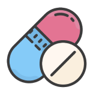
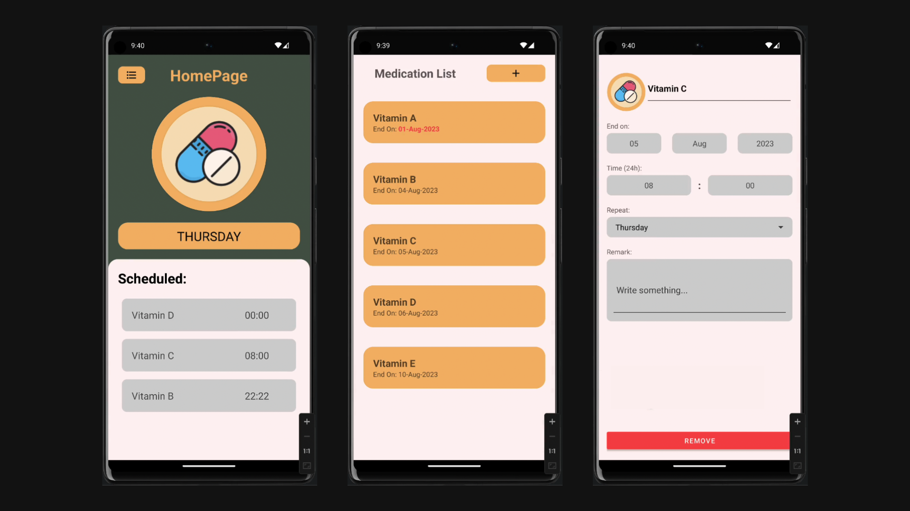

<p align="center">
  
</p>

# 💊 Medication App

This Kotlin-built 📱 Android app ensures you never miss a medication dose again! Designed with simplicity and ease of use in mind, it helps manage your medication schedules efficiently.

## 🌟 Features

- **📅 Upcoming Schedule:** Easily view your coming medication schedule on the home page, ensuring you're always prepared for your next dose.
- **🔍 Detailed Logs:** Track your medication history with ease.
- **🕒 Custom Schedules:** Tailor your medication reminders to fit your routine.

## Demo



## 🛠 Installation

First, clone this repository:

```bash
git clone 
```

Then, open it in Android Studio, connect your device or use an emulator, and click 'Run'.
